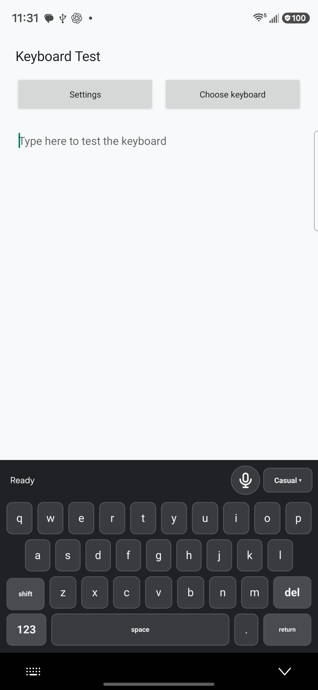
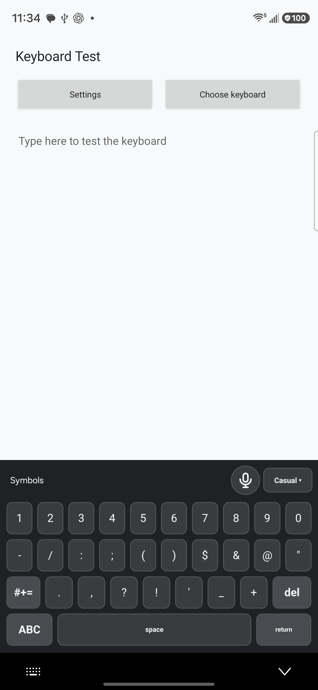
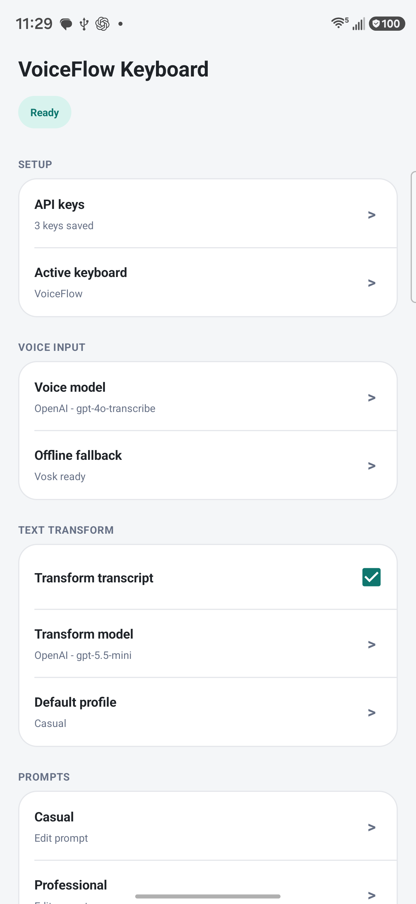
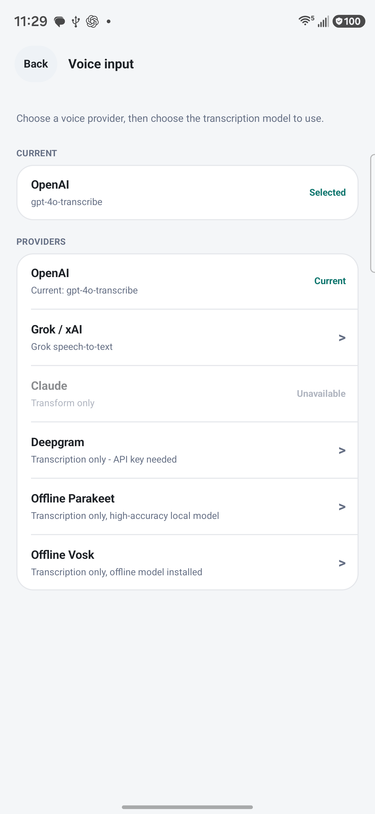
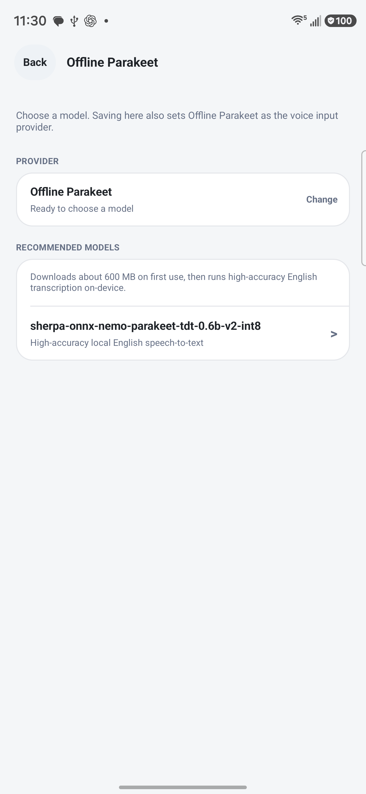

# VoiceFlow Keyboard

Open-source Android voice keyboard for people who want a Typeless-style mobile dictation workflow, AI dictation cleanup, and bring-your-own-key voice-to-text on any Android phone.

Record a voice note from the keyboard, transcribe it, optionally clean it with an LLM prompt, and insert the final text into any app. VoiceFlow Keyboard is a native Android IME, so it works anywhere a normal keyboard works: chat apps, email, notes, search, docs, forms, and coding tools.

> Not affiliated with Typeless, Voiceflow, Apple, Google, Anthropic, or OpenAI. "Typeless-style" is used only to describe the product category: voice-first mobile typing with AI cleanup.

## Screenshots











## Try It

Download the latest prototype APK from the [GitHub Releases page](https://github.com/yutungh/voiceflow-keyboard-android/releases/latest). Open the latest release, download the `voiceflow-keyboard-...-debug.apk` asset, then install it on your Android phone.

This is a debug-signed prototype build for sideloading and testing. For production use, build and sign your own release APK.

Release APKs are built by GitHub Actions from the public repository. They do not include `.env.local` and do not bundle any API keys.

## Why This Exists

Most mobile voice typing tools either insert raw dictation immediately or live inside one app. This project is a base for an Android keyboard that can:

- capture a full recording instead of live-inserting partial text,
- transcribe the recording,
- rewrite or lightly clean the transcript with a configurable prompt,
- insert the final result into the active text field,
- let users bring their own API key and model choices.

Good search terms for this project: Android voice keyboard, VoiceFlow Keyboard, Typeless alternative for Android, AI dictation keyboard, AI voice keyboard, OpenAI transcription keyboard, Grok transcription keyboard, Claude cleanup keyboard, offline voice typing Android, Parakeet offline transcription Android, Vosk offline keyboard, voice-to-text IME, prompt-based dictation cleanup, bring your own API key keyboard.

## Features

- Native Android input method service.
- Apple-inspired key layout and spacing.
- Permanent microphone button above the keys.
- Whole-clip recording: record first, transcribe after stop, then insert.
- OpenAI audio transcription via `/v1/audio/transcriptions`.
- Grok/xAI speech-to-text and transform support.
- Claude/Anthropic transform support.
- Deepgram speech-to-text support.
- Optional local offline transcription with compact Vosk or high-accuracy Parakeet via sherpa-onnx.
- Automatic offline transcription fallback when a cloud voice provider is selected but the phone has no validated internet connection.
- Settings control to download the compact offline fallback model before you need it.
- Optional transcript cleanup via configurable cloud transform providers.
- Editable API keys, providers, transcription models, transform models, and voice styles.
- Combined provider/model pickers for voice input and text transform setup.
- Voice styles: Friends and Work by default, optional Family and Partner templates, editable custom styles, and optional emoji icons for quick recognition.
- A mutually exclusive style picker replaces the disabled keys while dictation or translation is recording.
- A five-step expression control (`Reserved` through `Expressive`) adjusts conversational energy, punctuation, and permitted emoji use independently for each voice style.
- Voice styles apply to both transcript cleanup and natural target-language localization; voice instruction mode remains independent.
- Friends and Work automatically use bullets or numbering when the transcript is clearly a list, steps, tasks, instructions, options, or grouped items.
- Translation history remembers the target language and generated style variants for comparison or reuse.
- Retone can regenerate the last inserted dictation or translation from its original transcript, safely replace it when the field is unchanged, and keep alternate style/expression versions together in history.
- Low-latency GPT-5 transform settings with safe fallback retry.
- Minimal autocorrect layer using Android spell checker suggestions when available.
- Custom phrase replacement example: `Cloud Code` -> `Claude Code`.
- Smart spacing for voice inserts.
- Short voice outputs under 5 words do not get a forced trailing period.
- Haptics for keyboard taps.
- Symbols and expanded symbols views.

## Current Status

This is a working prototype and a base for other developers, not a finished consumer keyboard.

Known tradeoffs:

- API keys are stored locally in app preferences. For production, migrate to encrypted storage.
- Audio is sent to the configured transcription provider when using OpenAI transcription.
- Realtime streaming transcription is not implemented yet. Cloud transcription records the full clip and uploads after stop.
- Offline Vosk transcription downloads a compact local model on first use and runs the transcription on-device after recording stops.
- Offline Parakeet downloads a much larger local model, about 600 MB, on first use. It is intended as the higher-accuracy offline English option.
- Offline fallback uses an installed Parakeet model first, then an installed Vosk model. Use Settings > Voice input > Offline fallback to prepare the compact Vosk fallback before you need it.
- Autocorrect is intentionally conservative and much simpler than Gboard or Apple Keyboard.
- The UI is tuned for a modern Samsung/Android phone but is not exhaustively tested across devices.

## Build

Requirements:

- Android Studio or Android SDK
- JDK 17+

Build the debug APK:

```powershell
.\gradlew.bat assembleDebug
```

On macOS/Linux:

```bash
./gradlew assembleDebug
```

Output:

```text
app/build/outputs/apk/debug/app-debug.apk
```

## Install On A Phone

Enable Developer Options and USB Debugging on your Android phone. On Samsung devices, you may also need to disable Auto Blocker for sideloading.

If you downloaded an APK from Releases, install that APK:

1. Go to [Releases](https://github.com/yutungh/voiceflow-keyboard-android/releases/latest).
2. Download the APK asset named like `voiceflow-keyboard-vX.Y.Z-debug.apk`.
3. On your phone, open the APK and allow install from that source if Android asks.
4. Open **VoiceFlow Keyboard** from the app drawer.

If you built from source, install the generated debug APK:

Install:

```powershell
adb install -r app/build/outputs/apk/debug/app-debug.apk
```

Then:

1. Open **VoiceFlow Keyboard**.
2. Grant microphone permission.
3. Add your provider API keys if using cloud transcription or cleanup.
4. Choose your voice input model and transform model.
5. Open Android keyboard settings and enable **VoiceFlow Keyboard**.
6. Choose it from the keyboard picker.

## Private Local Install

For a personal phone build, you can keep API keys in an ignored `.env.local` file and seed them into the installed app preferences after install:

```powershell
.\gradlew.bat assembleDebug
.\scripts\install-private.ps1 -Serial YOUR_DEVICE_SERIAL
```

Supported local key names:

```text
OpenAIAPIKey=...
AnthropicAPIKey=...
XAIAPIKey=...
DeepgramAPIKey=...
```

This script does not compile keys into the APK. It installs the local debug APK, then writes the keys directly into the connected device's private app preferences with `adb run-as`.

## Recommended Model Setup

The default OpenAI flow is:

- transcription: `gpt-4o-transcribe`
- transform: a GPT-5 model

The transform request uses low-latency options for GPT-5-style cleanup tasks:

- `reasoning.effort: none`
- `text.verbosity: low`
- prompt caching key/retention
- fallback retry without optional latency fields if a selected model rejects them

Provider support:

- OpenAI: transcription and transform.
- Grok / xAI: transcription and transform.
- Claude / Anthropic: transform only.
- Deepgram: transcription only.
- Offline Parakeet: transcription only, high-accuracy English transcription through sherpa-onnx, with a large local model downloaded on first use.
- Offline Vosk: transcription only, compact local fallback model downloaded on first use.
- Offline fallback: when OpenAI, Grok / xAI, or Deepgram is selected for voice input and the phone has no validated internet connection, VoiceFlow records with installed Offline Parakeet first, then installed Offline Vosk.

## Voice Styles

The default public styles are **Friends** and **Work**.

**Friends** lightly cleans raw speech-to-text while preserving wording, tone, intent, hedging, slang, and order. **Work** rewrites the transcript into clearer, more polished professional text while preserving meaning and factual content.

Optional **Family** and **Partner** templates add recipient-aware warmth without inventing nicknames, facts, or emotions. Partner can permit a single fitting affectionate emoji when the message itself supports it. These templates are available from Settings but are not enabled in the public build by default.

While normal dictation or translation is recording, the disabled keyboard is covered by a single-select voice-style panel. The selected style can be changed before stopping and is applied in the same transform request, so it does not add another processing step. Voice instruction mode is excluded.

Built-in styles can format content as bullets or numbered steps when that structure naturally fits. For example, grocery lists, task lists, instructions, recipes, options, and step-by-step workflows do not need a separate Bullets mode.

You can add editable custom styles. Each style has:

- editable display name,
- editable dictation behavior,
- editable translation tone guidance,
- the same one-tap recording flow as the built-in profiles.

This makes the project useful as a base for:

- personal dictation cleanup,
- professional message drafting,
- task and instruction formatting,
- domain-specific terminology cleanup.

## Privacy Notes

This keyboard can read what you type and can record microphone audio while active, because that is how Android keyboards and dictation tools work.

Read [PRIVACY.md](PRIVACY.md) before using or modifying this app.

Current privacy model:

- The app does not include a bundled API key.
- Users bring their own provider API keys.
- API keys are saved locally on the device in app preferences.
- When a cloud transcription provider is enabled, recorded audio is sent to that provider after recording stops.
- When transcript cleanup is enabled, transcript text is sent to the configured transform provider.
- Offline Vosk and Offline Parakeet transcription keep audio local after the selected local model has been downloaded.

For a production release, you should:

- use encrypted preferences or Android Keystore for API keys,
- disable voice/network features in password, OTP, payment, and other sensitive fields,
- publish a clear privacy policy,
- avoid collecting logs that contain dictated text,
- consider a provider abstraction so users can choose local or cloud transcription.

## Roadmap Ideas

- Realtime streaming transcription to reduce perceived latency.
- Better custom dictionary and replacement UI.
- Encrypted API key storage.
- Undo last voice insert.
- Per-field safety rules.
- Better tablet/foldable layouts.
- More local transcription model options.
- Release builds and signing instructions.

## Contributing

Issues and pull requests are welcome. See [CONTRIBUTING.md](CONTRIBUTING.md).

## License

MIT. See [LICENSE](LICENSE).
